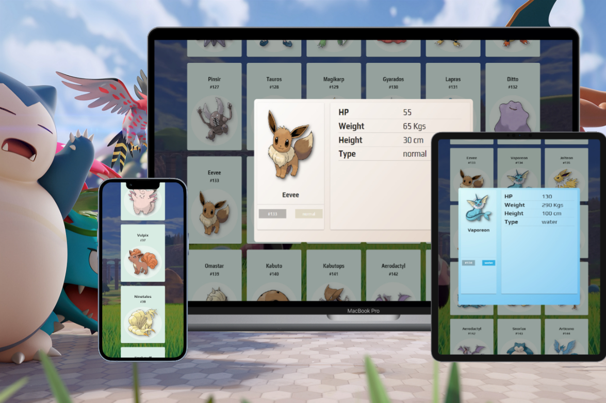

# Pokedex Card



> Projeto feito para apresentar no chapter front-end para estudos de Vue.js 3 e Vuetify. 

## 🚀 Instalando pokedex
```
npm install
```

### Compiles and hot-reloads for development
```
npm run serve
```

### Compiles and minifies for production
```
npm run build
```

### Lints and fixes files
```
npm run lint
```

### Customize configuration
See [Configuration Reference](https://cli.vuejs.org/config/).
